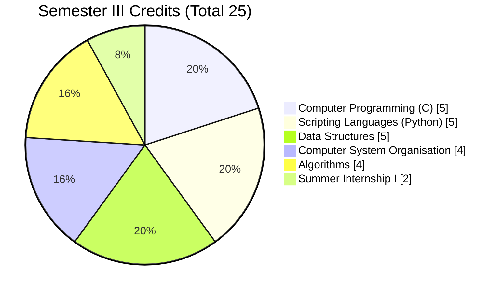
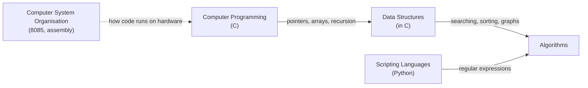

<h1>Piyush Nagendra</h1>

<h3>Diploma in Computer Science &amp; Engineering</h3>

Rajiv Gandhi Proudyogiki Vishwavidyalaya (RGPV), Diploma Wing, Bhopal

<i>C &nbsp;·&nbsp; Python &nbsp;·&nbsp; Data Structures &nbsp;·&nbsp; Algorithms</i>

  

---

## 👨‍💻 About Me

I am a **Diploma in Computer Science & Engineering** student at **Rajiv Gandhi Proudyogiki Vishwavidyalaya (Diploma Wing), Bhopal**, currently in **Semester III**. My focus is turning what I learn in class (C programming, Python scripting, data structures and algorithms) into small, working projects that I publish here.

**Goals:** master problem solving with C and Python, build a strong project portfolio, and secure a good internship and a path into B.Tech (lateral entry) or a software role.

---

## 🎓 Education

| Field | Details |
|---|---|
| **University** | Rajiv Gandhi Proudyogiki Vishwavidyalaya (RGPV), Diploma Wing, Bhopal |
| **Programme** | Diploma in Computer Science & Engineering (Branch Code C04) |
| **Scheme** | OCBC (Outcome-based, AICTE curriculum), implemented from July 2023 |
| **Current Semester** | III |

<!--
  To add more rows, paste them into the table above, for example:
  | **Institute** | Your Polytechnic Name, City |
  | **Session** | 2024 – 2027 |
  | **Previous Result** | 00.00 % |
-->

---

## 📊 Semester III at a Glance

**25 credits · 700 marks · 5 theory subjects · 3 lab subjects · 1 internship**

| Code | Subject | Theory Credits | Practical Credits | Total Marks |
|:---:|---|:---:|:---:|:---:|
| 301 | Computer Programming (C) | 3 | 2 | 150 |
| 302 | Scripting Languages (Python) | 3 | 2 | 150 |
| 303 | Data Structures | 3 | 2 | 150 |
| 304 | Computer System Organisation | 4 | 0 | 100 |
| 305 | Algorithms | 4 | 0 | 100 |
| n/a | Summer Internship - I | 0 | 2 | 50 |
| | **Total** | **17** | **8** | **700** |

**Exam pattern:** Theory subject = 30 term-work + 70 end-semester (3 hrs). Practical = 20 lab work + 30 practical/viva.

### Where the credits go

> **Takeaway:** 15 of 25 credits (60%) come from hands-on coding subjects (C, Python, Data Structures), and they carry 450 of 700 marks (about 64%). Consistent lab practice matters more than last-minute theory.

### How the subjects connect

### Study once, score in more than one paper

| Topic | Appears in |
|---|---|
| Searching and sorting | Data Structures (Unit 2) · Algorithms (Units 2, 3) |
| Graphs, BFS and DFS | Data Structures (Unit 5) · Algorithms (Unit 4) |
| Recursion | Computer Programming (Unit 5) · Scripting (Unit 4) · Algorithms (Unit 1) |
| Pointers and memory | Computer Programming (Unit 4) · Data Structures (Unit 1) |
| Regular expressions | Scripting (Unit 5) · Algorithms (Unit 5) |
| File handling | Computer Programming (Unit 2) · Scripting (Unit 5) |

---

## 🛠️ Tech Stack

**Semester III syllabus (RGPV)**

**Web and tools (self-learning)**

**Exploring next**

---

## 🧪 Practical Tracker (Semester III)

Updated as I complete each practical and push the code to a repository.

<b>Computer Programming (C): 12 practicals</b>

- [ ] Programming environment (editor, compiler)
- [ ] I/O statements and operators
- [ ] Expression evaluation and precedence
- [ ] Decision making and branching
- [ ] Loop statements
- [ ] Multi-dimensional arrays
- [ ] String manipulation functions
- [ ] Functions and parameter passing
- [ ] Recursion
- [ ] Pointers
- [ ] Dynamic memory allocation
- [ ] File operations

<b>Scripting Languages (Python): 7 practical groups</b>

- [ ] Basic syntax, print, comments
- [ ] Data types, input and arithmetic, string operations
- [ ] Lists, tuples, dictionaries
- [ ] Conditionals and loops
- [ ] Functions and modules
- [ ] File processing (read, write, append)
- [ ] Regular expressions (roll number and email validation)

<b>Data Structures (in C): 16 practicals</b>

- [ ] Linear search
- [ ] Binary search
- [ ] Insertion sort
- [ ] Bubble sort
- [ ] Quick sort
- [ ] Selection sort
- [ ] Heap sort
- [ ] Singly linked list
- [ ] Doubly linked list
- [ ] Circular linked list
- [ ] Stack (array and linked list)
- [ ] Queue (array and linked list)
- [ ] BFS
- [ ] DFS
- [ ] Binary tree of integers
- [ ] Minimum depth of a binary tree

---

## 🚀 Featured Projects

| Project | What it does | Tech | Link |
|---|---|---|---|
| **Digital Workshop** | Website for Digital Workshop & Electronic Components, Balaghat | HTML, CSS, JS, PHP | [Live site](https://digitalworkshop.kesug.com) |

More projects will be added here as I finish each set of practicals.

  

---

## 📈 GitHub Activity

---

## 🎯 Current Focus

- [x] Semester III RGPV Diploma CSE
- [ ] Complete all lab practicals and upload them to GitHub
- [ ] Solve problems daily in C and Python
- [ ] Build one mini project per subject
- [ ] Prepare for Summer Internship and placements

---

## 🤝 Connect

<!--
  Add these when you are ready (replace the placeholders):
  
  
-->

